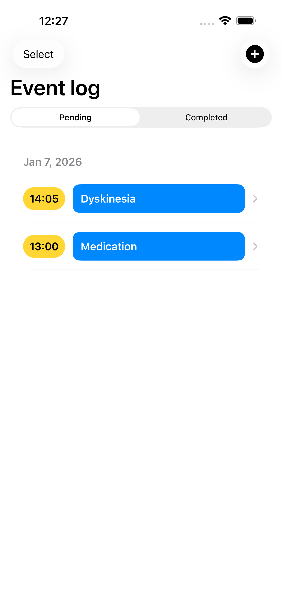
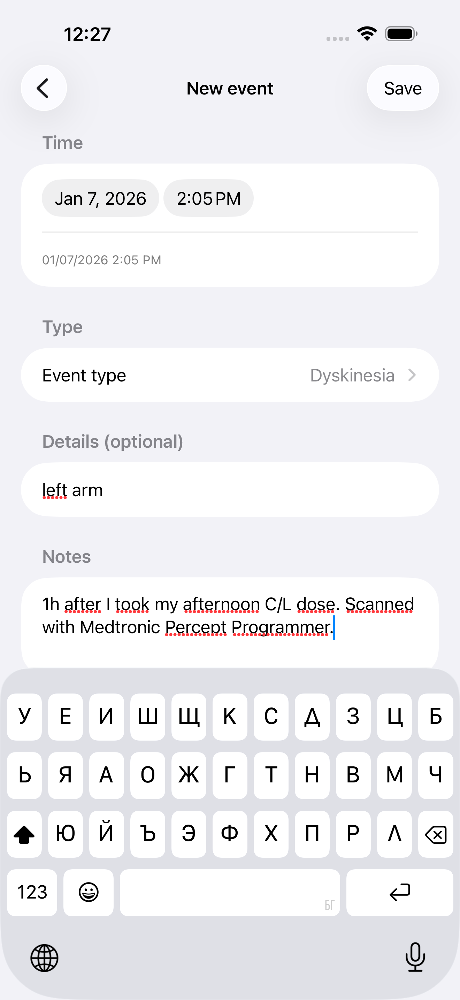
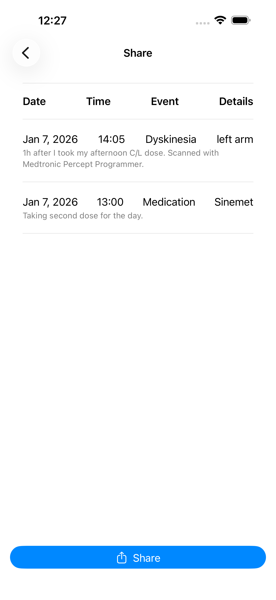

# Quick Demo
Screenshots captured on iPhone 17 Pro Max (iOS 26.2).

## Event list
The log shows the two sample events captured at 1:00 PM and 2:05 PM, ready for review or selection.

## Manual entry (dyskinesia)
Manual entry captures event type, details, and notes in one form. This example records a dyskinesia episode after medication and matches the adaptive DBS scan to the context of the patient's day.

## Share/export
Selected events are compiled into a structured export for review or sharing before a programming visit.

